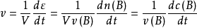
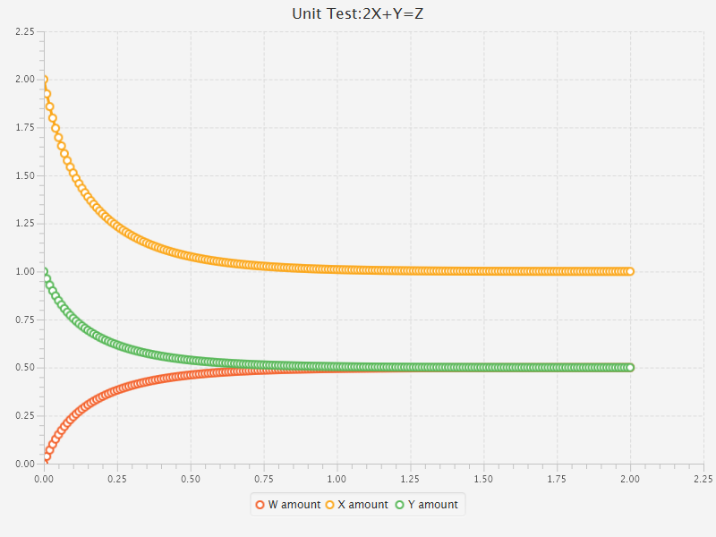
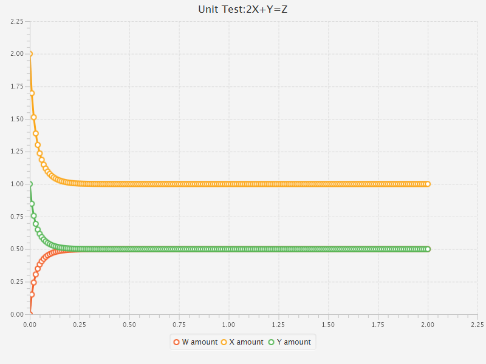
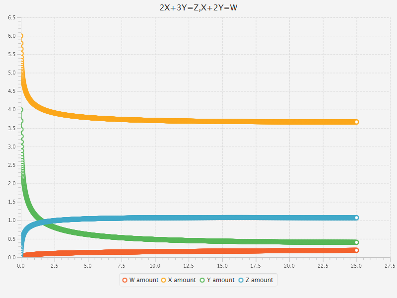
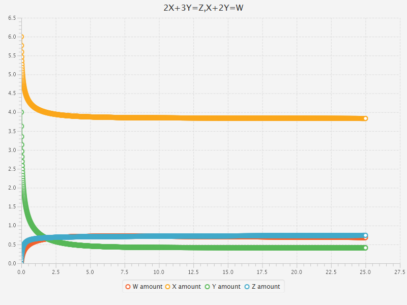

# 探究催化剂选择性对平衡的影响

## 预备知识

- 物质的量浓度

  单位体积内所含某种物质的物质的量。用$$c(A)=\frac{n(A)}{V}=[A]$$表示。

- 反应进度

  用来描述某一化学反应进行程度的物理量，具有与物质的量相同量纲。

  定义为：反应系统中任何一种反应物或生成物在反应过程中物质的量的变化与该物质的计量系数商。
  $$
  \xi =\frac{\Delta n(B)}{v(B)}
  $$
  ​

- 化学反应速率

  单位体积内反应进度对时间的变化率

  

- 基元反应

  基元反应是指在反应中一步直接转化为产物的反应，又称为简单反应。所有的可逆反应均为非基元反应。

由于可逆反应的机理复杂，大多需用实验直接测定其反应动力学方程，我们用基元反应近似代替非基元反应。

## 模拟实验的理论模型

考察可逆反应
$$
aX+bY = cP+dQ
$$
为简化过程，设反应物生成物均为气体，实验中环境温度保持不变，混合气体各向同性。

其反应动力学方程为：
$$
v_正 = k_正 [X]^a[Y]^b\qquad v_逆 = k_逆 [P]^c[Q]^d
$$
平衡常数为：
$$
K =\frac{[P]^c[Q]^d}{ [X]^a[Y]^b} =\frac{k_正}{k_逆}
$$
根据反应动力学方程，可获得反应的动力学方程组
$$
\frac{d[X]}{dt} =-av_正+av_逆\qquad \frac{d[Y]}{dt} =-bv_正+bv_逆
$$

$$
\frac{d[P]}{dt} =cv_正-cv_逆\qquad \frac{d[Q]}{dt} =dv_正-dv_逆
$$

为了简化算法设计，在不损失精度的情况下采用欧拉法进行数值计算。

## 模拟实验的算法

核心算法为：初始化反应->欧拉法迭代计算反应过程->处理实验结果

~~~java
@Override
	public void react(double time) {
		double V = getContainer().getVolume();
		Substance s1 = getContainer().find(names.get(0));
		Substance s2 = getContainer().find(names.get(1));
		Substance s3 = getContainer().find(names.get(2));
		Substance s4 = getContainer().find(names.get(3));
		double vp = coefficient_K_positive
				*Math.pow(s1.mol/V, coefficient_h.get(0))
				*Math.pow(s2.mol/V, coefficient_h.get(1));
		double vn = coefficient_K_negative
				*Math.pow(s3.mol/V, coefficient_h.get(2))
				*Math.pow(s4.mol/V, coefficient_h.get(3));
		s1.reduce(V*vp*coefficient_h.get(0)*time);
		s2.reduce(V*vp*coefficient_h.get(1)*time);
		s3.add(V*vp*coefficient_h.get(2)*time);
		s4.add(V*vp*coefficient_h.get(3)*time);
		s3.reduce(V*vn*coefficient_h.get(2)*time);
		s4.reduce(V*vn*coefficient_h.get(3)*time);
		s1.add(V*vn*coefficient_h.get(0)*time);
		s2.add(V*vn*coefficient_h.get(1)*time);
	}
~~~

具体设计见[GitHub仓库](github.com/hamiguazzz/MultiChemicalReactionSimulate)

## 单元测试用例（单位制为SI）

考察反应
$$
2X+Y=Z
$$
设$$k_+ = 1,k_-=1$,$[X]_0 = 2,[Y]_0 = 1,[Z]_0 = 0$$

计算可得末状态为$$[X]_0 = 1,[Y]_0 = 0.5,[Z]_0 =0.5$$

实验结果

完全符合理论计算结果

如果使用加速催化剂：（使用催化剂等价于同比例改变某个反应的$k_+,k_-$，反应速度改变而平衡常数不变）

可以更快速达到平衡：

## 探究实验

考察反应
$$
2X+3Y=Z\quad \cdots (A)\qquad X+2Y =W\quad \cdots (B)
$$
这是一个竞争反应，我们有初态$$[X]_0 = 6,[Y]_0 = 4,[Z]_0 = 0,[W]_0 = 0$$

反应的速率系数为$$k_{A+} =k_{B+} = 0.005$,$k_{A-}=k_{B-} =0.005,V=1L$$

[W:0.18995mol]
[X:3.6666mol]

在增加B反应的速率，使得其速率上升10倍，A反应不变时

可以观测到反应的过程发生了明显的变化，

[W:0.68403mol]
[X:3.8350mol]

显然X转为W的效率大幅度提升了。

## 结论

通过更多组的实验模拟可以见到，在竞争反应中，催化剂的选择性可以大幅度改变平衡时的结果，提高转化率。
